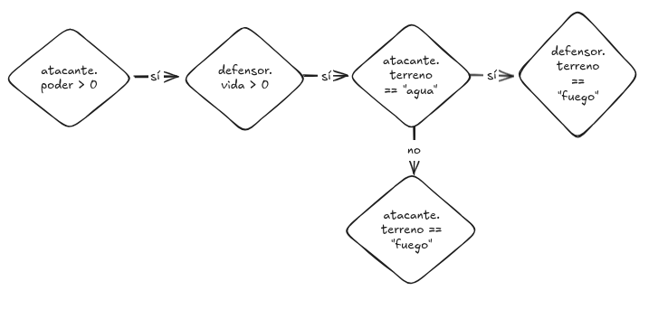

## Leer código espagueti

Dado el código en [lucha.go](./lucha.go)

0. Considera el ejemplo. Dados estos objetos como estado inicial, la línea que se ejecuta para modificar la vida del defensor es la *número 101*:
```go
var atacante = jugador{
	vida:    90,
	terreno: "tierra",
	poder:   40,
	x:       123,
	y:       0,
}
var defensor = jugador{
	vida:    30,
	terreno: "aire",
	poder:   40,
	x:       123,
	y:       0,
}
```


1. ¿Qué línea(s) se ejecutan dado el siguiente estado inicial?
```go
atacante := jugador{
	vida:    550, 
	terreno: "agua",
	poder:   60,  
	x:       100,
	y:       0,
}
defensor := jugador{
	vida:     440, 
	terreno:  "tierra",
	poder:    30,
	x:        200,
	y:        0,
}
```

2. ¿Qué línea(s) se ejecutan dado el siguiente estado inicial?
```go
atacante := jugador{
	vida:    220, 
	terreno: "agua",
	poder:   22,  
	x:       100,
	y:       0,
}
defensor := jugador{
	vida:     110, 
	terreno:  "tierra",
	poder:    11,
	x:        200,
	y:        0,
}
```

3. ¿Qué estado inicial se requiere para ejecutar la **línea número 91**?
```go
atacante := jugador{
	vida:    ?, 
	terreno: "?",
	poder:   ?,  
	x:       ?,
	y:       ?,
}
defensor := jugador{
	vida:     ?, 
	terreno:  "?",
	poder:    ?,
	x:        ?,
	y:        ?,
}
```

4. Dibuja el diagrama de flujo de la función Atacar (código espagueti).
Por ejemplo:

> Tip: Procurar poner las flechas verdaderas para un sentido y las falsas para otro sentido, o utilizar colores. El objetivo del diagrama es seguir más fácilmente los condicionales del código.